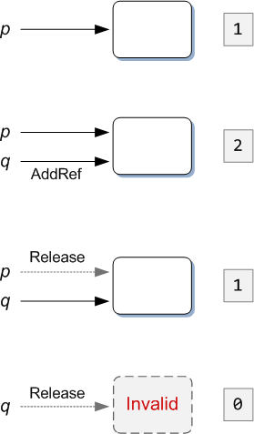

# Intro

En este curso no estudiamos uno a uno todos los aspectos de GLib y GObject; la mejor manera de familiarizarse con estos componentes es echar un vistazo a la documentación de referencia y buscar algún tutorial, como el de IBM (ver sección de lecturas).


# GLib

**GLib** es la librería base del proyecto GNOME. Provee al lenguaje C de muchas herramientas como estructuras de datos (listas enlazadas, árboles binarios, tablas hash) y utilidades como manipulación de strings.

En el siguiente ejemplo mostramos el uso de dos estructuras de datos implementadas en GLib: [GList](https://developer.gnome.org/glib/stable/glib-Doubly-Linked-Lists.html) (una lista doblemente enlazada), y [GHashTable](https://developer.gnome.org/glib/stable/glib-Hash-Tables.html) (una tabla asociativa).

```c
<#include src/glib-intro/main.c>
```

```sh
$ cd glib-intro
$ mkdir build && cd build
$ cmake -DCMAKE_BUILD_TYPE=Debug ..
$ make
$ ./glib-intro
<#exec cd src/glib-intro && (cmake -H. -B. -DCMAKE_BUILD_TYPE=Debug && make)\>/dev/null && ./glib-intro>
```

Dado que estamos trabajando en C, donde no hay gestión automática de la memoria, todas las estructuras deben ser explícitamente creadas y destruidas. La convención general es usar funciones `*_new()` para crear nuevas instancias, y `*_destroy()`, `*_free()`, o `*_unref()` para liberar su memoria.

Un detalle muy importante es que, por lo general, las estructuras de datos **NO** son dueñas de los datos que contienen, es decir que al destruir el contenedor no se libera al memoria de cada elemento contenido.


## Ejercicio: g_list_free_full()

Mostrar lo que ocurre si en `test_list_malloc()` liberamos la lista de la forma simple:

```c
g_list_free(list);
```

y luego ejecutamos el programa con Valgrind para descubrir memoria perdida:

```sh
$ valgrind --leak-check=full ./glib-intro
```

Comparar esto con el resultado de usar la función adecuada para liberar la memoria de cada elemento:

```c
g_list_free_full(list, g_free);
```


## Ejercicio: GHashTable

Escribir una función que, dado un string arbitrario, sea capaz de contar cuántas veces aparece cada carácter alfanumérico (es decir, solo letras y números).

Solución en `glib-exercise/main.c`


# GObject

**GObject** es la parte de GLib que añade a C la posibilidad de programar con orientación a objetos. Además, incluye el tipo fundamental [GType](https://developer.gnome.org/gobject/stable/chapter-gtype.html), en base al cual todo el sistema de tipos de GLib es construido.

Todos los objetos basados en `GObject` heredan de una clase del mismo nombre; esta clase implementa las capacidades básicas que aportan orientación a objetos y gestión de memoria:

* Construcción y destrucción de instancias.
* Gestión de memoria basada en *reference counting*: [Object memory management](https://developer.gnome.org/gobject/stable/gobject-memory.html).
* Métodos virtuales.
* Propiedades genéricas por instancia, con funciones get/set: [Object properties](https://developer.gnome.org/gobject/stable/gobject-properties.html).
* Señales asíncronas emitidas entre instancias: [Signals](https://developer.gnome.org/gobject/stable/signal.html).

Dado que C es un lenguaje puramente imperativo y no dispone de soporte para orientación a objetos, todo el sistema de clases de GObject requiere el uso intensivo de macros y conlleva un uso considerable de *boilerplate*.


## Construcción y destrucción

La clase base `GObject` (de la cual hereda cualquier otra clase que programemos) implementa varios métodos cuyo propósito es inicializar todas las estructuras de datos necesarias para manejar objetos:

1. El tipo de datos debe ser registrado en el sistema de tipos de `GType`: `G_DEFINE_TYPE()`.

2. La información estática de nuestra clase (por ejemplo: la implementación de funciones virtuales) debe ser almacenada en una estructura de clase: `<ClassName>_class_init()`. Una vez que la información estática ha sido establecida, esta función no vuelve a llamarse para el mismo tipo.

3. La información particular de cada instancia (por ejemplo: las propiedades dinámicas, los datos privados) deben ser almacenados en una estructura de instancia: `<ClassName>_init()`. Dado que la información particular debe ser tratada independientemente para cada instancia, esta función es llamada una vez por cada nuevo objeto que sea creado.

Por otro lado, en el momento de destruir la instancia de un objeto se ejecutan dos funciones de finalización:

1. `<ClassName>_dispose()` debe liberar todas las referencias que puedan estar siendo mantenidas por el objeto.

2. `<ClassName>_finalize()` debe liberar toda la memoria y otros recursos (como archivos abiertos) que puedan pertenecer al objeto.


## Reference counting

El mecanismo que más se evidencia en código GObject es el de referencias a objetos. El concepto es sencillo, y actúa en dos fases:

1. Al crear un objeto, se anota una referencia al mismo. Durante la vida de este objeto, otros módulos pueden tomar más referencias al mismo ([g_object_ref](https://developer.gnome.org/gobject/stable/gobject-The-Base-Object-Type.html#g-object-ref)), y liberarlas ([g_object_unref](https://developer.gnome.org/gobject/stable/gobject-The-Base-Object-Type.html#g-object-unref)) cuando ya no lo necesiten más.

2. Los recursos usados por el objeto, como memoria, son liberados en el momento en que la cuenta de referencias llega a 0. Es en ese momento cuando las funciones de destrucción son ejecutadas.




## Métodos virtuales

La información estática de una clase contiene, entre otras cosas, punteros a las implementaciones de todas las funciones virtuales que una clase pueda reimplementar desde su clase padre.

Mientras que lenguajes como C++ construyen la llamada `vtable` ([Virtual method table](https://en.wikipedia.org/wiki/Virtual_method_table)) de forma automática, en C debemos crear nuestra propia tabla virtual y rellenar los campos uno a uno. Es un trabajo que se antoja tedioso, pero por otro lado una manera muy instructiva de experimentar cómo funciona el despacho de métodos virtuales, ya que conceptualmente la implementación interna de C++ no dista mucho de la técnica manual que se debe usar con GObject.


Nuestro método `<ClassName>_class_init()` deberá inicializar una estructura privada, en la que es posible reemplazar cualquiera de las funciones virtuales que son declaradas por la clase padre. Esto se ve claramente en el ejemplo correspondiente a esta sección.


## Propiedades

Comparado con el mecanismo más tradicional de tener funciones `get`/`set` específicas para cada campo, las propiedades ofrecen métodos que permiten acceder de forma genérica mediante funciones ofrecidas por GObject:

* Reflexión: es posible consultar en tiempo de ejecución qué propiedades hay disponibles en un objeto dado, con funciones como `g_object_class_list_properties()` o `g_object_class_find_property()`.

* Abstracción: solo hace falta saber el nombre textual de la propiedad para poder acceder a ella de forma genérica, sin requerir funciones especiales de acceso en la API de nuestras clases, con `g_object_set_property()` o `g_object_set()` (y equivalentes para `get`).

Por ejemplo, una propiedad llamada "zoom-level" se almacenaría así:

```c
g_object_set_property (file, "zoom-level", 75);
g_object_set_property (file, "filename", "application.log");
```

Y de esa manera la propiedad `zoom-level` contendría el valor `75`, usando tan solo las funciones genéricas de GObject y por tanto sin haber necesitado una función pública concreta en la clase File. Y lo mismo para la propiedad `filename`.

También es posible guardar varias propiedades en una sola línea:

```c
g_object_set (file, "zoom-level", 75, "filename", "application.log", NULL);
```


## Señales

Siguiendo un mecanismo similar al de las propiedades, cualquier objeto basado en GObject puede declarar señales que serán emitidas para avisar de cualquier tipo de evento (a juicio de quien escriba el código de la clase).

Estas señales pueden ser configuradas con una función de *callback*, de forma que cuando suceda el evento, la función será llamada de forma asíncrona:

```c
static void
stream_ended_cb (int time, Stream* s)
{
  printf("The stream '%s' has ended with time '%d'", s->name, time);
}

g_signal_connect (stream, "ended",
    G_CALLBACK (stream_ended_cb), stream);
```

Con esto, nuestra función será ejecutada en algún momento futuro en el que el stream termine.


# Ejemplo

El código de ejemplo es bastante más extenso que los vistos en otros módulos de introducción, así que no se mostrará aquí.

Puedes compilarlo y ejecutarlo exactamente igual que en otras ocasiones hemos hecho con CMake:

```sh
$ cd gobject-intro
$ mkdir build && cd build
$ cmake ..
$ make
$ ./gobject-intro
```


# Lecturas

* GLib:

    - [IBM | Manage C data using the GLib collections](https://developer.ibm.com/tutorials/l-glib/)

        ¡CUIDADO! Tiene muchos ejemplos y es una buena guía, pero el texto está codificado como UTF8 y muchos símbolos (como `->`, `*`, etc.) no son ASCII: no se pueden copiar y pegar directamente, porque provocarán errores al compilar.

    - [GLib Reference Manual](https://developer.gnome.org/glib/stable/)

* GObject:
    - [GObject Doc | Part 1. Concepts](https://developer.gnome.org/gobject/stable/pt01.html)
    - [GObject Doc | Part 4. Tutorial](https://developer.gnome.org/gobject/stable/pt02.html)
    - [Subclassing GObject](https://developer.gnome.org/SubclassGObject/)
    - [GObject Reference Manual](https://developer.gnome.org/gobject/stable/)
    - [GNOME Platform Demos in C](https://developer.gnome.org/gnome-devel-demos/stable/c.html.en)
