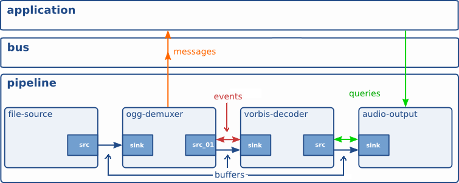
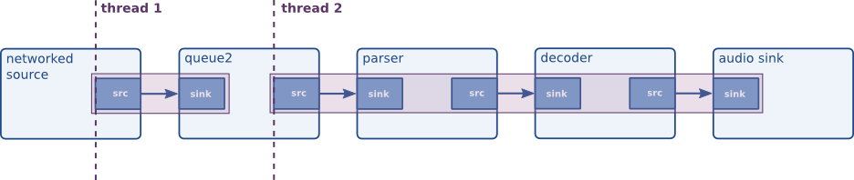

# Intro

GStreamer es una de las librerías más completas que existen para crear aplicaciones multimedia. Consiste en una serie de elementos que pueden ser conectados entre sí para formar una cadena de procesamiento, con la cual podremos hacer manipulación, presentación, y grabación de los flujos de media.

La otra gran librería de procesamiento multimedia es FFmpeg; la principal diferencia entre ambas es que cada elemento de GStreamer ofrece una función "opaca" y no es necesario saber cómo está implementado por dentro, mientras que FFmpeg trabaja a un nivel más bajo, exigiendo un conocimiento más profundo sobre los codecs y los formatos que se manejen.


## Organización

GStreamer se divide en componentes llamados *elementos*, y cada elemento contiene una funcionalidad muy concreta. La idea es que combinemos múltiples elementos para ir formando cada vez una funcionalidad más compleja:

* Cada elemento existe en forma de archivo `.so` instalado en el sistema. Este archivo será cargado dinámicamente en el momento en que se use por primera vez.

    Los elementos de GStreamer cumplen una única función en la cadena de procesamiento de media. Así, por ejemplo, tenemos elementos distintos para los pasos de parseo, demultiplexación, y decodificación de un stream de vídeo.

* La aplicación utiliza la librería principal de GStreamer (`libgstreamer-1.0.so`) para inicializar un registro central, que busca y prepara la carga dinámica opcional de todos los elementos disponibles en el sistema (mediante el método `dlopen()` que vimos en la introducción a C).

Los elementos de GStreamer se instalan todos en 3 grandes módulos, separados por motivos de calidad de software y/o licencias:

1. **gst-plugins-good** contiene todos los plugins con soporte prioritario. Estos elementos se consideran estables y además no existen problemas de licencias o royalties ya que por lo general todos son LGPL.

2. **gst-plugins-bad** son plugins que tienen buena calidad y deberían funcionar bien, pero su distribución podría dar problemas, sobre todo por restricciones de licencia.

3. **gst-plugins-ugly** contiene plugins que no están a la altura de los otros dos módulos. Podría ser que funcionen, pero les falta algo: o una buena revisión del código, documentación, tests, o incluso alguien que lo mantenga. No te sorprendas si acabas teniendo que lidiar con bugs en algún plugin de este módulo.


## Instalación

Para instalar GStreamer y los tres módulos principales, en Debian/Ubuntu:

```sh
$ sudo apt-get update && sudo apt-get install --yes \
    gstreamer1.0-tools \
    gstreamer1.0-plugins-good \
    gstreamer1.0-plugins-bad \
    gstreamer1.0-plugins-ugly
```


# Pipelines

Los elementos de GStreamer se combinan unos con otros para formar una "cadena de trabajo" (**pipeline**) y así procesar el media de la manera que necesitemos.

Cada elemento dispone de una serie de **pads**, que son los conectores de entrada o salida usados para encadenar elementos entre sí. Un pad de entrada se llama **sink**, y un pad de salida se llama **source**:


El tipo de datos que fluye de un pad *source* a un pad *sink* está bien tipado y definido en unas estructuras llamadas **caps** (de *capabilities*). Estos *caps* se negocian al iniciar el procesamiento de la pipeline, desde los elementos finales (**downstream** o "abajo", a la derecha de la imagen) hacia los iniciales (**upstream** o "arriba", a la izquierda). Una vez negociados, los *caps* no pueden cambiar.

El error más típico que encontraremos es que dos elementos no se pongan de acuerdo en la información que quieren intercambiar, generando un mensaje "`streaming task paused, reason not-linked`".


## Comunicación

Estos son los mecanismos de comunicación que ocurren en una pipeline GStreamer:

* **Buffers**: son los objetos que llevan datos del media (es decir, frames de video, o samples de audio). Siempre viajan hacia abajo (*downstream*), es decir desde los *sources* hacia los *sinks*.

* **Eventos**: son señales que se envían los elementos entre sí, para informarse de algunas situaciones importantes (como por ejemplo que un vídeo va a terminar, o que un buffer se ha llenado). Pueden viajar tanto hacia arriba como hacia abajo.

* **Mensajes**: son señales que cualquier elemento puede publicar en el bus de mensajes que GStreamer provee a la aplicación. Estos mensajes pueden ser procesados asíncronamente por la aplicación, e informan de situaciones como errores, cambios de estado, progreso de los buffers, etc.

* **Queries**: son llamadas que la aplicación puede hacer sobre cualquier elemento para solicitar información sobre el procesamiento que se está llevando a cabo. Así, la aplicación puede solicitar el estado de la reproducción de un archivo, el tiempo actual, o la duración de un vídeo.




## Threading

Por norma general, el paso de datos entre elementos y el procesamiento de esos datos se realiza todo desde el mismo hilo. En *pipelines* simples como la mostrada arriba, sería el mismo hilo el que vaya alternando entre los diferentes elementos para ir moviendo la información de unos a otros.

Podemos introducir nuevos hilos en nuestra *pipeline*, mediante el uso del elemento **queue**. Este elemento introduce una cola FIFO (First-In, First-Out) en la que la entrada y la salida se ejecutan en hilos independientes, en forma del clásico *productor-consumidor*:




## Pads

Un elemento dado puede tener más o menos *pads* dependiendo del momento de la ejecución. Según el momento en que el *pad* aparezca, los clasificamos por tipos:

* **Estáticos** (***always***): Son *pads* que siempre están disponibles. Por ejemplo, un elemento *queue* siempre tendrá un *pad* de entrada (*sink*) y un *pad* de salida (*source*).

* **Dinámicos** (***sometimes***): Son *pads* que solo están disponibles cuando el media que fluye por el elemento requiere de la existencia de uno o más *pads*. Por ejemplo, un elemento *demux* creará varios pads dinámicos de salida, uno por cada flujo de vídeo existente en el media.

* **Request**: Son *pads* que la aplicación solicita expresamente al elemento. Algunos elementos tienen salidas opcionales, y sólo las harán efectivas cuando la aplicación lo requiera. Por ejemplo, el elemento *rtpbin* puede encargarse de enviar y recibir paquetes RTCP, pero solo lo hará si la aplicación solicita un *pad* llamado *send_rtcp_src*; en caso contrario, no se generarán paquetes RTCP.


# Herramientas

## gst-inspect

Esta utilidad de consola sirve para solicitar a GStreamer toda la información disponible acerca de un elemento, para lo cual solo necesitaremos saber su nombre. Podremos ver la versión, nombre completo, el archivo `.so` en el que está el plugin, la herencia de clases que implementa, el tipo de *pads* que el elemento maneja, las propiedades, y los métodos disponibles:

```sh
$ gst-inspect-1.0 vp8enc
Factory Details:
  Rank                     primary (256)
  Long-name                On2 VP8 Encoder
  Klass                    Codec/Encoder/Video
  Description              Encode VP8 video streams
  Author                   David Schleef <ds@entropywave.com>, Sebastian Dröge <sebastian.droege@collabora.co.uk>

Plugin Details:
  Name                     vpx
  Description              VP8 plugin
  Filename                 /usr/lib/x86_64-linux-gnu/gstreamer-1.0/libgstvpx.so
  Version                  1.8.3
  License                  LGPL
  Source module            gst-plugins-good
  Source release date      2016-08-19
  Binary package           GStreamer Good Plugins (Ubuntu)
  Origin URL               https://launchpad.net/distros/ubuntu/+source/gst-plugins-good1.0

GObject
 +----GInitiallyUnowned
       +----GstObject
             +----GstElement
                   +----GstVideoEncoder
                         +----GstVPXEnc
                               +----GstVP8Enc

Implemented Interfaces:
  GstPreset
  GstTagSetter

Pad Templates:
  SRC template: 'src'
    Availability: Always
    Capabilities:
      video/x-vp8
                profile: { 0, 1, 2, 3 }

  SINK template: 'sink'
    Availability: Always
    Capabilities:
      video/x-raw
                 format: I420
                  width: [ 1, 16383 ]
                 height: [ 1, 16383 ]
              framerate: [ 0/1, 2147483647/1 ]
[...]
```


## gst-launch

Este comando es la estrella de todas las pruebas hechas con GStreamer. Permite construir *pipelines* básicas (y no tan básicas) directamente desde línea de comandos, sin escribir una sola línea de código.

Esta herramienta es fundamental a la hora de prototipar *pipelines* y experimentar con uno o varios elementos para entender cómo funcionan y cómo usarlos; posteriormente, traduciremos ese conocimiento en código real que implemente la pipeline en nuestra aplicación.

Todos los ejemplos y ejercicios que hagamos estarán basados en el uso de `gst-launch`.


### Sintaxis

`gst-launch` recibe como argumento una descripción de *pipeline*, que sigue una sintaxis muy concreta y con la que especificamos todos los elementos y sus conexiones, de acuerdo a nuestras necesidades.

A grandes rasgos, la sintaxis de este comando consiste en nombres de elementos, seguidos de propiedades de los mismos, y por último conexiones entre elementos mediante el carácter `!`. Por ejemplo:

* Reproducir un archivo MP3:

    ```
    gst-launch-1.0 filesrc location=music.mp3 ! mad ! alsasink
    ```

* Convertir un archivo MP3 a Ogg Vorbis:

    ```sh
    $ gst-launch-1.0 \
        filesrc location=music.mp3 \
        ! mad ! audioconvert \
        ! vorbisenc ! oggmux \
        ! filesink location=music.ogg
    ```


# Elementos útiles

A la hora de hacer pruebas, hay algunos elementos auxiliares que combinan la funcionalidad de varios otros, lo cual puede simplificar mucho el trabajo si solo queremos hacer una prueba rápida.


## auto{video,audio}{src,sink}

Los elementos `autovideosrc` y `autoaudiosrc` son capaces de crear un flujo de ejemplo, conteniendo varios tipos de videos o audios, configurable mediante sus propiedades.

Por otro lado, `autovideosink` y `autoaudiosink` elegirán el método más adecuado para reproducir el vídeo o audio entrante; esto normalmente significa que se abrirá una ventana para reproducir vídeo, y el audio se escuchará por los altavoces preferidos del sistema.

Ejemplo:

```sh
$ gst-launch-1.0 autovideosrc ! queue ! autovideosink
```


## decodebin

Este elemento es capaz de decodificar cualquier formato, y su salida será un flujo de audio o video RAW, el cual puede ser usado por ejemplo por elementos como `autovideosink` o como entrada de un codec.


## playbin

Este elemento es un todo-en-uno que contiene todo lo necesario para decodificar y reproducir un gran número de formatos, de modo que podremos pasarle prácticamente cualquier fuente.

Por ejemplo, es capaz de manejar URIs como `http://`, `dvd://`, `file://`, y más. `playbin` usará `decodebin` para detectar el codec y aplicará el decoder correspondiente. Después, usará elementos `auto*` para mostrarlos por pantalla o hacerlos sonar por los altavoces.

Ejemplo:

```sh
$ gst-launch-1.0 playbin uri=file:///path/to/movie.mp4
```


# Ejemplos

## Ej. 1: Reproducir un video por HTTP

En este ejemplo crearemos una pipeline sencilla que nos permita reproducir un vídeo alojado en un servidor HTTP.

```sh
$ export VIDEO_URL='https://www.freedesktop.org/software/gstreamer-sdk/data/media/sintel_trailer-480p.webm'
```

```sh
$ gst-launch-1.0 playbin uri="$VIDEO_URI"
```

¡Ya está!

Gracias a todos los automatismos que vienen incluidos con `playbin`, con este elemento tenemos suficiente. Simplemente le dejamos que haga el trabajo de autodetección y elección de los elementos necesarios.

Sin embargo, usando `playbin` no aprendemos mucho. Vamos a hacer casi lo mismo, pero eligiendo a mano cada elemento. Para que sea más sencillo, ignoramos el audio y nos limitamos a mostrar el vídeo:

```sh
$ gst-launch-1.0 \
    souphttpsrc location="$VIDEO_URL" \
    ! matroskademux \
    ! queue ! vp8dec ! autovideosink
```

Podemos ver en la documentación de [matroskademux](https://gstreamer.freedesktop.org/data/doc/gstreamer/head/gst-plugins-good/html/gst-plugins-good-plugins-matroskademux.html) que este elemento tiene **dos** *pads* de salida (*sources*): uno para el vídeo y otro para el audio.

En `gst-launch`, podemos referirnos a ambos *pads* si le damos un nombre al elemento:

```sh
$ gst-launch-1.0 \
    souphttpsrc location="$VIDEO_URI" \
    ! matroskademux name=demux \
    demux.audio_0 ! queue ! vorbisdec ! autoaudiosink \
    demux.video_0 ! queue ! vp8dec ! autovideosink
```

Esta última *pipeline* es la que implementamos en `gstreamer-example-1/main.c`.


## Ej. 2: Reproducir un stream RTP

Vamos a crear una pipeline capaz de retransmitir un flujo de video mediante el protocolo RTP.

Tenemos muchos ejemplos de comandos GStreamer para emitir RTP en la documentación de Kurento: [RTP Streaming Commands](https://doc-kurento.readthedocs.io/en/stable/knowledge/rtp_streaming.html).

```sh
$ gst-launch-1.0 -e \
    filesrc location="video.mp4" ! decodebin \
    ! x264enc tune=zerolatency \
    ! rtph264pay ! "application/x-rtp,payload=(int)103,clock-rate=(int)90000" \
    ! udpsink host=127.0.0.1 port=5004
```

Con esta pipeline, estamos leyendo el archivo "*video.mp4*", decodificando (*decodebin*), y codificando de nuevo en *H.264* (*x264enc*). Así obtenemos un vídeo en un formato conocido y controlado por nosotros.

Después, el flujo de video resultante se paquetiza en formato RTP (*rtph264pay*) y se envía a una IP y puerto determinados (*udpsink*).

Cualquier reproductor compatible con RTP y H.264 debería ser capaz de recibir el stream RTP y reproducirlo. El único detalle importante a tener en cuenta es que el reproductor necesita saber la información sobre el formato de vídeo y los detalles de paquetizado; es decir, lo que el stream RTP contiene en su interior. Esta información no es posible deducirla simplemente a partir de los paquetes según se vayan recibiendo.

Por eso, o bien tenemos alguna manera de decirle explícitamente al receptor qué formato va a recibir, o bien lo escribimos en forma de **archivo SDP**, el estándar usado hoy día para transmitir este tipo de información.


### Receptor 1: VLC

Para abrir este stream RTP con VLC, necesitamos crear antes un archivo SDP en el que se describan las características:

```sh
$ tee "stream.sdp" >/dev/null <<'EOF'
v=0
o=- 0 0 IN IP4 127.0.0.1
s=-
c=IN IP4 127.0.0.1
t=0 0
m=video 5004 RTP/AVP 103
a=rtpmap:103 H264/90000
a=sendonly
a=ssrc:112233 cname:user@example.com
EOF
```

```sh
$ cvlc stream.sdp
```


### Receptor 2: FFmpeg

De manera similar al caso de VLC, podemos pedirle a FFmpeg que reproduzca el stream RTP, pasándole como origen el archivo SDP que describe nuestro media:

```sh
$ ffplay stream.sdp
```


### Receptor 3: GStreamer

Vamos a aprovechar que GStreamer permite establecer los valores de formato directamente, de forma explícita, para ver cómo podríamos reproducir el stream sin usar el archivo SDP:

```sh
$ gst-launch-1.0 -e \
    udpsrc port=5004 \
    ! "application/x-rtp,media=(string)video,clock-rate=(int)90000,encoding-name=(string)H264,payload=(int)103" \
    ! rtph264depay ! decodebin ! autovideosink
```

Esta pipeline hace lo opuesto de lo que hacía la pipeline del emisor. La única novedad es que, como ya se ha explicado, no es posible obtener la información necesaria del propio stream, así que hay que proporcionársela al receptor de alguna manera. En este caso, definimos los *caps* directamente como un string en el comando `gst-launch`.

Si omitimos la información del *caps*, el elemento *rtph264depay* no será capaz de depaquetizar el stream entrante, y tendremos un error en la consola.


# Lecturas

* Conceptos básicos:

    - [Foundations](https://gstreamer.freedesktop.org/documentation/application-development/introduction/basics.html)

    - [What are elements?](https://gstreamer.freedesktop.org/documentation/application-development/basics/elements.html)

    - [Pads and capabilities](https://gstreamer.freedesktop.org/documentation/application-development/basics/pads.html)

    - [Threading](https://gstreamer.freedesktop.org/documentation/application-development/advanced/threads.html#when-would-you-want-to-force-a-thread)

* Herramientas:

    - [gst-launch](https://gstreamer.freedesktop.org/documentation/tools/gst-launch.html)

    - [gst-inspect](https://gstreamer.freedesktop.org/documentation/tools/gst-inspect.html)

* [GStreamer Tutorials](https://gstreamer.freedesktop.org/documentation/tutorials/index.html)
